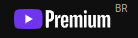
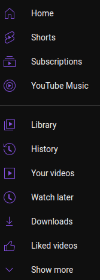

# Youtube Themer

A chrome extension to personalize the YouTube website.

## Installation

- First Download the extension by clicking here => (https://github.com/lnardon/YoutubeThemer/archive/master.zip)
- Unzip the pack and go to your Chrome extensions tab
- Enable Developer Mode on the page
- Click on the "Load Unpacked" Button and choose the folder of the extension
